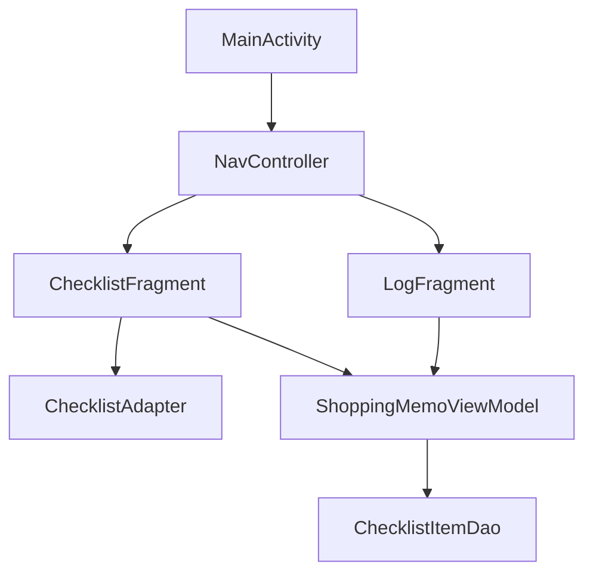

## アプリ概要
シンプルなお買い物メモアプリです。  
チェックリスト一覧ページと、購入ログ一覧ページの２画面で構成されています。

---

### アプリ画面
1. 「追加」ボタン押下で項目追加
2. チェックボックスにチェックを付けると出現する「購入済みにする」ボタンを押下する
3. 2でチェックを付けた商品が購入ログカレンダーページの該当の日付に表示される  

---

### クラス構成概要
このプロジェクトは、以下のクラスで構成されています。

- `MainActivity`: アプリケーションのメイン画面を表示するアクティビティ
  - `ChecklistFragment`: チェックリストを表示するフラグメント。画面１
    - `ChecklistAdapter`: RecyclerViewにアイテムを表示するためのアダプター
  - `LogFragment`: 購入ログを表示するフラグメント。画面２

　
- `ShoppingMemoViewModel`: 各フラグメントで表示するアイテムを管理するクラス
  - `ChecklistItemDao`: SQLiteデータベースの管理クラス

---

### データベース構成概要
ローカルデータの保存にはSQLiteデータベースを利用しています。

|物理名|データ型|備考|
|--|--|--|
|id|INTEGER|オートインクリメント|
|name|TEXT|商品名|
|is_check|INTEGER|チェックフラグ|
|is_delete|INTEGER|削除フラグ|
|created_at|TEXT|作成日時|
|updated_at|TEXT|更新日時|

　
- チェックリスト一覧ページに表示するデータ
  - is_check = 0 かつ is_delete = 0
- 購入ログ一覧ページに表示するデータ
  - is_check = 1 かつ is_delete = 0
